# Cafe Sales Analysis

The main goal of this project is to showcase my data cleaning skills using SQL and how they seamlessly support the data exploration and analysis process.

## Tools Used
- MySQL
- Excel

## Navigation
[Cafe Sales Analysis](#cafe-sales-analysis)
- [1. Background](#1-background)
- [2. Introduction of Dataset](#2-introduction-of-dataset)
- [3. Data Cleaning and Preprocessing](#3-data-cleaning-and-preprocessing)
    - [3.1 Data Import](#31-data-import)
    - [3.2 Data Cleaning](#32-data-cleaning)
        - [3.2.1 Remove Duplicates](#321-remove-duplicates)
        - [3.2.2 Data Standardization](#322-data-standardization)
        - [3.2.3 Handle Missing Values](#323-handle-missing-values)
- [4. Exploratory Data Analysis](#4-exploratory-data-analysis)
    - [4.1 What is the most sold item?](#41-what-is-the-most-sold-item)
    - [4.2 What is the average sales?](#42-what-is-the-average-sales)
    - [4.3 What are customers' spending habits?](#43-what-are-customers-spending-habits)
    - [4.4 Which item has the highest sales?](#44-which-item-has-the-highest-sales)
    - [4.5 Sales by payment method](#45-sales-by-payment-method)
    - [4.6 Sales by location](#46-sales-by-location)
    - [4.7 Sales by month](#47-sales-by-month)
    - [4.8 Which item is the best-seller each month?](#48-which-item-is-the-best-seller-each-month)
    - [4.9 Sales by season](#49-sales-by-season)
    - [4.10 Sales by day](#410-sales-by-day)
- [5. Dashboard](#5-dashboard)
- [6. Conclusion and Recommendations](#6-conclusion-and-recommendations)


## 1. Background
In recent years, the coffee market has grown rapidly, with increasing competition among both established chains and smaller independent cafés. As consumer preferences continue to evolve, understanding customer behavior has become essential for staying competitive. To thrive in this environment, coffee shops need to make smarter, data-driven decisions around products, promotions, and customer experience.

This project analyzes one year of transaction data from a café to discover key patterns in sales performance, product popularity, payment and location preferences.

The goal is to provide practical recommendations that support better decision-making around menu planning, promotional timing, and operational improvements, ultimately helping the café grow more efficiently while better meeting the needs of its customers.

## 2. Introduction of Dataset
The dataset used for this project is from https://www.kaggle.com/datasets/ahmedmohamed2003/cafe-sales-dirty-data-for-cleaning-training/data. It includes fields such as transaction ID, product name, quantity purchased, and so on. These details provide valuable insights into sales performance from various perspectives.

Features:
- **Transaction ID**: A unique identifier for each transaction.
- **Item**: The name of the item purchased.
- **Quantity**: The quantity of the item purchased.
- **Price Per Unit**: The price of a single unit of the item.
- **Total Spent**: The total amount spent on the transaction. Calculated as Quantity * Price Per Unit.
- **Payment Method**: The method of payment used.
- **Location**: The location where the transaction occurred.
- **Transaction Date**: The date of the transaction.

## 3. Data Cleaning and Preprocessing
Before diving into analysis, it is important to check the data for any inconsistencies such as missing or invalid values, and to perform necessary preprocessing to ensure data quality.

### 3.1 Data Import
I create a new database ‘project’ and import all the data as a text datatype. The reason for this is that MYSQL will truncate records when it detects any imported value that doesn’t match the data type of the column they are being imported into. In this case, invalid values such as ‘ERROR’, and ‘UNKNOWN’ are text data types which can be found in numeric and date columns.

In addition, I'll create a new table and work on a copy of the dataset to prevent any changes to the original data.
```sql
CREATE TABLE cafe_sales_copy
LIKE cafe_sales;

INSERT cafe_sales_copy
SELECT * 
FROM cafe_sales;

SELECT * 
FROM cafe_sales_copy
LIMIT 5;
```
### 3.2 Data Cleaning
#### 3.2.1 Remove Duplicates
First, I’ll check the dataset for duplicate records and remove them if found.
```sql
WITH duplicate_cte AS (
	SELECT *, ROW_NUMBER() OVER (
    PARTITION BY `Transaction ID`, Item, Quantity, `Price Per Unit`, `Total Spent`, `Payment Method`, Location, `Transaction Date`
    ORDER BY `Transaction ID`) AS row_num
    FROM cafe_sales)
SELECT * FROM duplicate_cte
WHERE row_num > 1; -- There are no duplicates
```
#### 3.2.2 Data Standardization
Data standardization, the process of converting raw data into a common format to enable us to process and analyze it, is an important step as it ensures consistency in the data.

I verify if all 10000 unique Transaction IDs follow the same format. In this case, I check if all unique IDs are in the same length.
```sql
SELECT DISTINCT length(`Transaction ID`) as ID_length
FROM cafe_sales_copy; -- The length of all IDs is 11
```

In order to correct the numeric and date columns with the appropriate datatypes, I must ensure that the values are all in the same format:
```sql
-- Standardize column 'Item'
 UPDATE cafe_sales_copy
 SET Item = NULL
 WHERE Item IN ('ERROR', 'UNKNOWN', '');
```
```sql
-- Standardize column 'Quantity'
UPDATE cafe_sales_copy 
SET Quantity = NULL
WHERE Quantity IN ('ERROR', 'UNKNOWN', '');
```
```sql
-- Correct datatype
ALTER TABLE cafe_sales_copy MODIFY Quantity INT;
```
```sql
-- Standardize column 'Price Per Unit'
-- Correct format
UPDATE cafe_sales_copy
SET `Price Per Unit` = 
			CASE
				WHEN `Price Per Unit` = '1.0' THEN '1.00'
                WHEN `Price Per Unit` = '1.5' THEN '1.50'
                WHEN `Price Per Unit` = '2.0' THEN '2.00'
                WHEN `Price Per Unit` = '3.0' THEN '3.00'
                WHEN `Price Per Unit` = '4.0' THEN '4.00'
                WHEN `Price Per Unit` = '5.0' THEN '5.00'
                ELSE NULL
			END;

-- Correct datatype
ALTER TABLE cafe_sales_copy MODIFY `Price Per Unit` DECIMAL(10,2);
```
```sql
-- Standardize column 'Total Spent'
-- Correct format
UPDATE cafe_sales_copy
SET `Total Spent` = 
			CASE
				WHEN `Total Spent` = '1.0' Then '1.00'
                WHEN `Total Spent` = '1.5' Then '1.50'
                WHEN `Total Spent` = '2.0' Then '2.00'
                WHEN `Total Spent` = '3.0' Then '3.00'
                WHEN `Total Spent` = '4.0' Then '4.00'
                WHEN `Total Spent` = '4.5' Then '4.50'
                WHEN `Total Spent` = '5.0' Then '5.00'
                WHEN `Total Spent` = '6.0' Then '6.00'
                WHEN `Total Spent` = '7.5' Then '7.50'
                WHEN `Total Spent` = '8.0' Then '8.00'
                WHEN `Total Spent` = '9.0' Then '9.00'
                WHEN `Total Spent` = '10.0' Then '10.00'
                WHEN `Total Spent` = '12.0' Then '12.00'
                WHEN `Total Spent` = '15.0' Then '15.00'
                WHEN `Total Spent` = '16.0' Then '16.00'
                WHEN `Total Spent` = '20.0' Then '20.00'
                WHEN `Total Spent` = '25.0' Then '25.00'
                ELSE NULL
			END;

-- Correct datatype
ALTER TABLE cafe_sales_copy MODIFY `Total Spent` DECIMAL(10,2);
```
```sql
-- Standardize column 'Payment Method'
UPDATE cafe_sales_copy
SET `Payment Method` = NULL
WHERE `Payment Method` IN ('ERROR', 'UNKNOWN', '');
```
```sql
-- Standardize column 'Location'
UPDATE cafe_sales_copy
SET Location = NULL 
WHERE Location IN ('ERROR', 'UNKNOWN', '');
```
```sql
-- Standardize column 'Transaction Date'
UPDATE cafe_sales_copy 
SET `Transaction Date` = NULL
WHERE `Transaction Date` IN ('ERROR', 'UNKNOWN', '');

-- Correct format
UPDATE cafe_sales_copy 
SET `Transaction Date` = STR_TO_DATE(`Transaction Date`, '%Y-%m-%d');

-- Correct datatype
ALTER TABLE cafe_sales_copy MODIFY `Transaction Date` DATE;
```

#### 3.2.3 Handle Missing Values
Previously, I standardize all missing and invalid values by converting them to NULL, allowing for easier tracking and handling within queries.
```sql
-- Missing values overview
SELECT
SUM(Item IS NULL) AS item_null,
SUM(Quantity IS NULL) AS quantity_null,
SUM(`Price Per Unit` IS NULL) AS price_per_unit_null,
SUM(`Total Spent` IS NULL) AS total_spent_null,
SUM(`Payment Method` IS NULL) AS payment_method_null,
SUM(Location IS NULL) AS location_null,
SUM(`Transaction Date` IS NULL) AS date_null
FROM cafe_sales_copy;
```
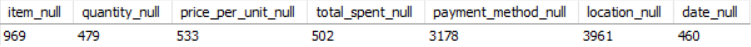

I first focus on filling the missing data with the data already available to us. For example, with a simple 'SELECT DISTINCT' statement, we can identify the 'price per unit' for each unique 'item' and then replace the null values with the correct price:
```sql
-- First, I find the price per unit for each unique item
SELECT DISTINCT Item, 
`Price Per Unit`
FROM cafe_sales_copy
WHERE Item IS NOT NULL AND `Price Per Unit` IS NOT NULL;

-- Fill in missing values
UPDATE cafe_sales_copy
SET `Price Per Unit` = 3.00
WHERE `Price Per Unit` IS NULL AND Item = 'Cake';

UPDATE cafe_sales_copy
SET `Price Per Unit` = 2.00
WHERE `Price Per Unit` IS NULL AND Item = 'Coffee';

UPDATE cafe_sales_copy
SET `Price Per Unit` = 1.00
WHERE `Price Per Unit` IS NULL AND Item = 'Cookie';

UPDATE cafe_sales_copy
SET `Price Per Unit` = 3.00
WHERE `Price Per Unit` IS NULL AND Item = 'Juice';

UPDATE cafe_sales_copy
SET `Price Per Unit` = 5.00
WHERE `Price Per Unit` IS NULL AND Item = 'Salad';

UPDATE cafe_sales_copy
SET `Price Per Unit` = 4.00
WHERE `Price Per Unit` IS NULL AND Item = 'Sandwich';

UPDATE cafe_sales_copy
SET `Price Per Unit` = 4.00
WHERE `Price Per Unit` IS NULL AND Item = 'Smoothie';

UPDATE cafe_sales_copy
SET `Price Per Unit` = 1.50
WHERE `Price Per Unit` IS NULL AND Item = 'Tea';

UPDATE cafe_sales_copy
SET `Price Per Unit` = round(`Total Spent` / Quantity, 2)
WHERE `Price Per Unit` IS NULL AND (Quantity IS NOT NULL AND `Total Spent` IS NOT NULL);
```
By using the data available and applying simple calculations such as multiplying the '**price per unit**' and '**quantity**', we can work out the missing '**Total Spent**' values:
```sql
-- Fill in missing values for column 'Total Spent'
UPDATE cafe_sales_copy 
SET `Total Spent` = Quantity * `Price Per Unit`
WHERE `Total Spent` IS NULL AND Quantity IS NOT NULL;
```
```sql
-- Fill in missing values for column 'Quantity'
UPDATE cafe_sales_copy 
SET Quantity = ROUND(`Total Spent` / `Price Per Unit`)
WHERE Quantity IS NULL AND `Total Spent` IS NOT NULL;
```

An issue arises when imputing item names based on their fixed prices. Since items like 'Cake' and 'Juice' share identical pricing, it's not possible to reliably distinguish between them. To avoid inaccurate assumptions, we assign a combined label such as 'Cake/Juice' to represent these ambiguous cases:
```sql
-- Fill in missing values for column 'Item'
UPDATE cafe_sales_copy 
SET Item = 'Cake/Juice'
WHERE Item IS NULL AND `Price Per Unit` = 3.00;

UPDATE cafe_sales_copy 
SET Item = 'Coffee'
WHERE Item IS NULL AND `Price Per Unit` = 2.00;

UPDATE cafe_sales_copy 
SET Item = 'Cookie'
WHERE Item IS NULL AND `Price Per Unit` = 1.00;

UPDATE cafe_sales_copy 
SET Item = 'Salad'
WHERE Item IS NULL AND `Price Per Unit` = 5.00;

UPDATE cafe_sales_copy 
SET Item = 'Sandwich/Smoothie'
WHERE Item IS NULL AND `Price Per Unit` = 4.00;

UPDATE cafe_sales_copy 
SET Item = 'Tea'
WHERE Item IS NULL AND `Price Per Unit` = 1.50;
```

There is no additional information to assist us in filling the missing values for '**Payment Method**' and '**Location**', therefore we assign those values as '**Unknown**':
```sql
-- Fill in missing values for column 'Payment Method'
UPDATE cafe_sales_copy 
SET `Payment Method` = 'Unknown'
WHERE `Payment Method` IS NULL;
```
```sql
-- Fill in missing values for column 'Location'
UPDATE cafe_sales_copy 
SET Location = 'Unknown'
WHERE Location IS NULL;
```

To handle missing values in the '**Transaction Date**' field, I employ a fill-down method, populating null entries with the subsequent valid date. Although this may introduce slight inaccuracies, it preserves valuable information that would otherwise be lost if the entire row were removed.
```sql
-- Fill in missing values for column 'Transaction Date'
WITH date_fix AS (
	SELECT 
	`Transaction ID`,
	COALESCE(`Transaction Date`, LAG(`Transaction Date`) OVER (ORDER BY `Transaction ID`)) AS filled_date
	FROM cafe_sales_copy
)
UPDATE cafe_sales_copy c1
JOIN date_fix c2
ON c1.`Transaction ID` = c2.`Transaction ID`
SET c1.`Transaction Date` = c2.filled_date;
```

At this point, I find 26 rows that contain a total of 52 NULL values across four columns.
```sql
SELECT * FROM cafe_sales_copy
WHERE Item IS NULL OR
Quantity IS NULL OR
`Price Per Unit` IS NULL OR
`Total Spent` IS NULL; -- 26 rows containing the 52 NULL values
```
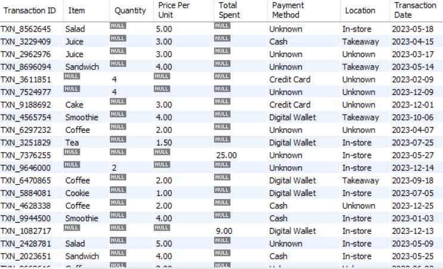

To handle the remaining null values, I will use the mode, which represents the most frequently occurring value in a dataset and is often considered the most likely outcome.

In the 20 rows with missing values, the '**Price Per Unit**' is available. To complete these records, I will fill the missing '**Total Spent**' with the most common value associated with each specific '**Price Per Unit**'.
```sql
-- Find the mode values to fill the nulls where 'Price Per Unit' is known 
-- Find the most 'Total Spent' value when price per unit is 5.00
SELECT DISTINCT 
`Total Spent`, 
COUNT(`Total Spent`) AS frequency 
FROM cafe_sales_copy
WHERE `Price Per Unit` = 5.00
GROUP BY `Total Spent`
ORDER BY 1 DESC
lIMIT 1; -- 25.00 is the most frequency total when unit price is 5.00

-- Find the most 'Total Spent' value when price per unit is 4.00
SELECT DISTINCT 
`Total Spent`, 
COUNT(`Total Spent`) AS frequency 
FROM cafe_sales_copy
WHERE `Price Per Unit` = 4.00
GROUP BY `Total Spent`
ORDER BY 1 DESC
LIMIT 1; -- 20.00 is the most frequency total when unit price is 4.00

-- Find the most 'Total Spent' value when price per unit is 3.00
SELECT DISTINCT 
`Total Spent`, 
COUNT(`Total Spent`) AS frequency 
FROM cafe_sales_copy
WHERE `Price Per Unit` = 3.00
GROUP BY `Total Spent`
ORDER BY 1 DESC
LIMIT 1; -- 15.00 is the most frequency total when unit price is 3.00

-- Find the most 'Total Spent' value when price per unit is 2.00
SELECT DISTINCT 
`Total Spent`, 
COUNT(`Total Spent`) AS frequency 
FROM cafe_sales_copy
WHERE `Price Per Unit` = 2.00
GROUP BY `Total Spent`
ORDER BY 1 DESC
LIMIT 1; -- 10.00 is the most frequency total when unit price is 2.00

-- Find the most 'Total Spent' value when price per unit is 1.50
SELECT DISTINCT 
`Total Spent`, 
COUNT(`Total Spent`) AS frequency 
FROM cafe_sales_copy
WHERE `Price Per Unit` = 1.50
GROUP BY `Total Spent`
ORDER BY 1 DESC
LIMIT 1; -- 7.50 is the most frequency total when unit price is 1.50

-- Find the most 'Total Spent' value when price per unit is 1.00
SELECT DISTINCT 
`Total Spent`, 
COUNT(`Total Spent`) AS frequency 
FROM cafe_sales_copy
WHERE `Price Per Unit` = 1.00
GROUP BY `Total Spent`
ORDER BY 1 DESC
LIMIT 1; -- 5.00 is the most frequency total when unit price is 1.00
```

```sql
-- Fill in the null values with the mode
-- Fill in where price per unit is 5.00 and other columns are null
UPDATE cafe_sales_copy
SET `Total Spent` = 25.00,
    Quantity = 5
WHERE `Price Per Unit` = 5.00 AND (Quantity IS NULL AND `Total Spent` IS NULL);

-- Fill in where price per unit is 4.00 and other columns are null
UPDATE cafe_sales_copy
SET `Total Spent` = 20.00,
    Quantity = 5
WHERE `Price Per Unit` = 4.00 AND (Quantity IS NULL AND `Total Spent` IS NULL);

-- Fill in where price per unit is 3.00 and other columns are null
UPDATE cafe_sales_copy
SET `Total Spent` = 15.00,
    Quantity = 5
WHERE `Price Per Unit` = 3.00 AND (Quantity IS NULL AND `Total Spent` IS NULL);

-- Fill in where price per unit is 2.00 and other columns are null
UPDATE cafe_sales_copy
SET `Total Spent` = 10.00,
    Quantity = 5
WHERE `Price Per Unit` = 2.00 AND (Quantity IS NULL AND `Total Spent` IS NULL);

-- Fill in where price per unit is 1.50 and other columns are null
UPDATE cafe_sales_copy
SET `Total Spent` = 7.50,
    Quantity = 5
WHERE `Price Per Unit` = 1.50 AND (Quantity IS NULL AND `Total Spent` IS NULL);

-- Fill in where price per unit is 1.00 and other columns are null
UPDATE cafe_sales_copy
SET `Total Spent` = 5.00,
    Quantity = 5
WHERE `Price Per Unit` = 1.00 AND (Quantity IS NULL AND `Total Spent` IS NULL);
```

The same approach was applied to complete the remaining columns '**Quantity**' and '**Total Spent**'.

'**Quantity**':
```sql
-- Find the mode values to fill the nulls where 'Total Spent' is known
-- Find the most 'Price Per Unit' value when total spent is 25.00
SELECT DISTINCT 
`Price Per Unit`, 
COUNT(`Price Per Unit`)
FROM cafe_sales_copy
WHERE `Total Spent` = 25.00
GROUP BY `Price Per Unit`
ORDER BY 1 DESC
LIMIT 1; -- 5.00 is the most frequent 'Price Per Unit' when 'Total Spent' is 25.00

-- Find the most 'Price Per Unit' value when total spent is 20.00
SELECT DISTINCT 
`Price Per Unit`, 
COUNT(`Price Per Unit`)
FROM cafe_sales_copy
WHERE `Total Spent` = 20.00
GROUP BY `Price Per Unit`
ORDER BY 1 DESC
LIMIT 1; -- 5.00 is the most frequent 'Price Per Unit' when 'Total Spent' is 20.00

-- Find the most 'Price Per Unit' value when total spent is 9.00
SELECT DISTINCT 
`Price Per Unit`, 
COUNT(`Price Per Unit`)
FROM cafe_sales_copy
WHERE `Total Spent` = 9.00
GROUP BY `Price Per Unit`
ORDER BY 1 DESC
LIMIT 1; -- 3.00 is the most frequent 'Price Per Unit' when 'Total Spent' is 9.00

-- Fill in the null values with the mode
-- Fill in where total spent is 25.00 and other columns are null
UPDATE cafe_sales_copy
SET Item = 'Salad',
	Quantity = 5,
    `Price Per Unit` = 5.00
WHERE `Total Spent` = 25.00 AND (Item IS NULL AND Quantity IS NULL AND `Price Per Unit` IS NULL);

-- Fill in where total spent is 20.00 and other columns are null
UPDATE cafe_sales_copy
SET Item = 'Salad',
	Quantity = 4,
    `Price Per Unit` = 5.00
WHERE `Total Spent` = 20.00 AND (Item IS NULL AND Quantity IS NULL AND `Price Per Unit` IS NULL);

-- Fill in where total spent is 9.00 and other columns are null
UPDATE cafe_sales_copy
SET Item = 'Cake/Juice',
	Quantity = 3,
    `Price Per Unit` = 3.00
WHERE `Total Spent` = 9.00 AND (Item IS NULL AND Quantity IS NULL AND `Price Per Unit` IS NULL);
```

'**Total Spent**':
```sql
-- Find the mode values to fill the nulls where 'Quantity' is known
-- Find the most 'Total Spent' Value when quantity is 4
SELECT DISTINCT 
`Total Spent`, 
COUNT(`Total Spent`)
FROM cafe_sales_copy
WHERE Quantity = 4
GROUP BY `Total Spent`
ORDER BY 1 DESC 
LIMIT 1; -- 20.00 is the most frequency Total Spent when quantity is 4

-- Find the most 'Total Spent' Value when quantity is 2
SELECT DISTINCT 
`Total Spent`, 
COUNT(`Total Spent`)
FROM cafe_sales_copy
WHERE Quantity = 2
GROUP BY `Total Spent`
ORDER BY 1 DESC 
LIMIT 1; -- 10.00 is the most frequency Total Spent When quantity is 2

-- Fill in the null values with the mode
-- Fill in where quantity is 4 and other columns are null
UPDATE cafe_sales_copy
SET Item = 'Salad',
    `Price Per Unit` = 5.00,
	`Total Spent` = 20.00
WHERE Quantity = 4 AND (Item IS NULL AND `Price Per Unit` IS NULL AND `Total Spent` IS NULL);

-- Fill in where quantity is 2 and other columns are null
UPDATE cafe_sales_copy
SET Item = 'Salad',
    `Price Per Unit` = 5.00,
	`Total Spent` = 10.00
WHERE Quantity = 2 AND (Item IS NULL AND `Price Per Unit` IS NULL AND `Total Spent` IS NULL);
```

Finally, all missing values have been successfully handled.
```sql
SELECT
SUM(Item IS NULL) AS item_null,
SUM(Quantity IS NULL) AS quantity_null,
SUM(`Price Per Unit` IS NULL) AS price_per_unit_null,
SUM(`Total Spent` IS NULL) AS total_spent_null,
SUM(`Payment Method` IS NULL) AS payment_method_null,
SUM(Location IS NULL) AS location_null,
SUM(`Transaction Date` IS NULL) AS date_null
FROM cafe_sales_copy; -- All columns have no missing values
```
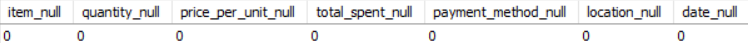

## 4. Exploratory Data Analysis
### 4.1 What is the most sold item?
```sql
SELECT DISTINCT
Item,
sum(Quantity) AS Total_Quantity
FROM cafe_sales_copy
GROUP BY 1
ORDER BY 2 DESC; -- Coffee is the most sold item with 3929
```
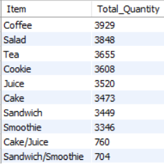

*Insights*:
- **Coffee** leads the list with **3929** units sold, suggesting it’s a consistent daily purchase, likely a routine item for regular customers.
- **Salad** ranks second with **3848** units sold, very close to coffee. This suggests a strong interest in fresh or healthy options.
- **Sandwich (3,449) and Smoothie (3,346)** are the two least popular items. **Recommendation**: **Consider refreshing the menu or experimenting with new flavors** to boost their performance.
- The quantity sold across items shows only **slight variation**, suggesting a balanced distribution of sales. This even spread reflects a well-rounded menu that appeals to a wide range of customer preferences. As a result, revenue remains stable, and business risk is reduced due to the lack of reliance on any single item.

### 4.2 What is the average sales?
```sql
SELECT
min(`Total Spent`) AS Min_Spent,
max(`Total Spent`) AS Max_Spent,
round(avg(`Total Spent`), 2) AS Average_sales
FROM cafe_sales_copy; -- Average sales is 8.94
```
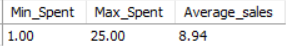

*Insights*:
- The average spending of **8.94** falls within the mid-to-low price range, indicating that most customers tend to shop within the '**affordable spending**' segment.
- **Recommendation**: **Promoting 7.00-10.00 bundled products as the default choice** could match customer expectations and drive higher order values.
- The difference between the **lowest (1.00) and highest (25.00)** spending is 24.00, which suggests diverse customer spending habits.

### 4.3 What are customers' spending habits?
```sql
WITH distribution_table AS (
SELECT
	CASE
		WHEN `Total Spent` BETWEEN 1.00 AND 5.00 THEN '1.00 - 5.00'
        WHEN `Total Spent` BETWEEN 5.00 AND 10.00 THEN '5.00 - 10.00'
        WHEN `Total Spent` BETWEEN 10.00 AND 15.00 THEN '10.00 - 15.00'
        WHEN `Total Spent` BETWEEN 15.00 AND 20.00 THEN '15.00 - 20.00'
        ELSE 'Over 20'
        END AS total_spent_range,
        count(*) AS Frequency
FROM cafe_sales_copy
GROUP BY 1
)
SELECT
total_spent_range,
Frequency,
concat(round(Frequency * 100 / (SELECT sum(Frequency) FROM distribution_table) , 2), '%') AS percentage
FROM distribution_table
GROUP BY 1
ORDER BY 2 DESC; -- Almost 70% of the total spent in a single transaction ranges between $1.00 and $10.00
```
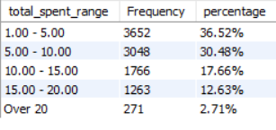

*Insights*:
- The distribution is **right-skewed**. **Over two-thirds** of transactions fall within the **1.00–10.00** range, suggesting that most customers are making small, affordable purchases.
- Only **17.66%** of customers spend between **10.00–15.00**, and **12.63%** spend between **15.00–20.00**, indicating that larger or bundled purchases are less common.
- Just **2.71%** of transactions exceed **20**, showing that premium-priced orders are not a core part of the sales structure. 
- **Recommendation**: **Consider designing value-added combos (e.g. drink + snack) priced around 10.00–15.00** to encourage slightly higher spend without pricing out most customers.

### 4.4 Which item has the highest sales?
```sql
SELECT
Item,
sum(`Total Spent`) AS Total_sales,
concat(round((sum(`Total Spent`) * 100 / (SELECT sum(`Total Spent`) FROM cafe_sales_copy)), 2), '%') AS percentage
FROM cafe_sales_copy
GROUP BY 1
ORDER BY 2 DESC; -- Salad has the highest sales with 19240
```
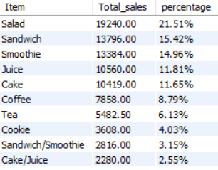

*Insights*:
- With **19240** in total sales (**21.51%** of overall revenue), **Salad** is the café’s top revenue contributor, indicating customers are willing to pay for healthier or higher-quality meal options.
- **Sandwiches and Smoothies** follow closely, with revenue shares of **15.42% and 14.96%**, respectively, showing that while these two items aren't the bestsellers by volume, their higher prices play a key role in driving overall revenue.
- **Cookie** generates the **least** amount of revenue of $3,608, contributing **4.03%** of total revenue. This could be due to its lower price point, or perhaps customers are steering away from high-calorie options.
- **Coffee** accounts for just **8.79%** of total revenue, and **Tea** even less at **6.13%**. This is likely due to their lower unit prices, despite strong sales volume, their impact on overall revenue remains limited.
- **Recommendation**: **Promoting high-margin items, optimizing combos, and upselling low-priced items** can help the café boost revenue while maintaining a well-balanced menu.

### 4.5 Sales by payment method
```sql
SELECT
`Payment Method`,
sum(`Total Spent`) AS Total_sales,
concat(round((sum(`Total Spent`) * 100 / (SELECT sum(`Total Spent`) FROM cafe_sales_copy)), 2), '%') AS percentage
FROM cafe_sales_copy
GROUP BY 1
ORDER BY 2 DESC; -- Credit Card is the known payment method that has the highest sales
```
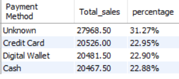

*Insights*:
- **Around one-third** of the transactions are marked with an "**unknown**" payment method. This lack of classification requires prompt attention to **improve tracking accuracy and uncover opportunities for optimization**, ultimately leading to more actionable insights.
- All **known payment methods** each make up roughly **22.9%** of total sales, showing that customers **don’t have a strong preference for any single payment method**, so it’s important to ensure the availability of multiple payment options to accommodate different spending habits.
- **Non-cash payments** account for **45.85%** of total sales, highlighting that cashless payment has become a mainstream trend.
- **Recommendations**: It may be worth **encouraging cashless payments**. These methods provide **a better transaction experience for customers and businesses** as they are **faster and reduce errors** in handling cash **compared to traditional cash payment methods**.

### 4.6 Sales by location
```sql
SELECT
Location,
sum(`Total Spent`) AS Total_sales,
concat(round((sum(`Total Spent`) * 100 / (SELECT sum(`Total Spent`) FROM cafe_sales_copy)), 2), '%') AS percentage
FROM cafe_sales_copy
GROUP BY 1
ORDER BY 2 DESC; -- In-store is the known location that has the highest sales
```
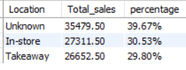

*Insights*:
- Almost **40%** of revenue is labeled as "**Unknown**" transaction locations. **Tracking systems must be refined to avoid data inaccuracy for clearer business insights**.
- Sales from **in-store and takeaway** orders are **quite close**, accounting for approximately **30.5% and 29.8%** respectively. This suggests that **customer preferences are fairly balanced across consumption scenarios**.

### 4.7 Sales by month
```sql
SELECT
monthname(`Transaction Date`) AS `month`,
sum(`Total Spent`) AS Total_sales,
concat(round((sum(`Total Spent`) * 100 / (SELECT sum(`Total Spent`) FROM cafe_sales_copy)), 2), '%') AS percentage
FROM cafe_sales_copy
GROUP BY 1
ORDER BY 2 DESC; -- January has the hightest sales with 7808.50 but pretty even across the board
```
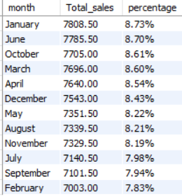

*Insights*:
- The **highest** Revenue by month is **January (7808.50)**, and the **lowest** is **February (7003.00)**, displaying a **difference of 805.50**.

- **Monthly sales proportions** range between **7.8% and 8.7%**, with **a maximum difference of less than 1%**. indicating that **overall sales performance is very stable**.

- **Recommendation**: It’s recommended to **maintain consistent operational standards and avoid heavily skewed resource allocation** because there’s no clear peak or off-season in current sales.

### 4.8 Which item is the best-seller each month?
```sql
WITH best_seller_by_month AS (
SELECT
Item,
monthname(`Transaction Date`) AS `month`,
sum(Quantity) AS Total_Sold,
ROW_NUMBER() OVER (PARTITION BY monthname(`Transaction Date`) ORDER BY sum(Quantity) DESC) AS `rank`
FROM cafe_sales_copy
GROUP BY 1, 2
)
SELECT
`month`,
Item,
Total_Sold
FROM best_seller_by_month
WHERE `rank` = 1
ORDER BY FIELD(`month`,
  'January','February','March','April','May','June',
  'July','August','September','October','November','December');
```
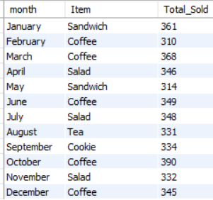

*Insights*:
- **Coffee** is the **top-selling** item in **6 out of 12 months (February, March, June, October, and December)**, aligning with its role as a daily beverage and a warm comfort drink.
- **Salad** takes the lead in **April, July, and November**, mostly during warmer months, highlighting its seasonal appeal as a light and healthy option.
- **Sandwiches** dominate in **January and May**, likely driven by breakfast or quick meal consumption. **Tea and Cookies** lead in **August and September** respectively **but showed weaker performance in other months**.
- **Recommendation**: **Consider adjusting menu by highlighting seasonal bestsellers, placing them at the top or tagging them as "Recommended"** to boost conversion rates.

### 4.9 Sales by season
```sql
SELECT
	CASE
		WHEN month(`Transaction Date`) = 1 THEN 'Winter'
        WHEN month(`Transaction Date`) = 2 THEN 'Winter'
        WHEN month(`Transaction Date`) = 3 THEN 'Spring'
        WHEN month(`Transaction Date`) = 4 THEN 'Spring'
        WHEN month(`Transaction Date`) = 5 THEN 'Spring'
        WHEN month(`Transaction Date`) = 6 THEN 'Summer'
        WHEN month(`Transaction Date`) = 7 THEN 'Summer'
        WHEN month(`Transaction Date`) = 8 THEN 'Summer'
        WHEN month(`Transaction Date`) = 9 THEN 'Fall'
        WHEN month(`Transaction Date`) = 10 THEN 'Fall'
        WHEN month(`Transaction Date`) = 11 THEN 'Fall'
        WHEN month(`Transaction Date`) = 12 THEN 'Winter'
	END AS season,
sum(`Total Spent`) AS Total_sales,
concat(round((sum(`Total Spent`) * 100 / (SELECT sum(`Total Spent`) FROM cafe_sales_copy)), 2), '%') AS percentage
FROM cafe_sales_copy
GROUP BY 1
ORDER BY 2 DESC; -- Spring has the hightest sales with 22687.50 but pretty even across the board
```
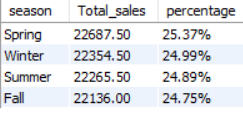

*Insights*:
- **Sales are evenly distributed across all four seasons**, with **Spring** leading slightly at **25.37%**, and **Fall** the lowest at **24.75%**.
- This balance suggests **no strong seasonality in customer demand**, indicating that the café attracts a steady flow of customers year-round.
- **Recommendation**: **Seasonal promotions during occasions like Christmas, New Year, Easter, and Halloween** can boost sales by **providing festive-themed products or seasonal discounts**.

### 4.10 Sales by day
```sql
SELECT
dayname(`Transaction Date`) AS `Day of Week`,
sum(`Total Spent`) AS Total_sales,
concat(round((sum(`Total Spent`) * 100 / (SELECT sum(`Total Spent`) FROM cafe_sales_copy)), 2), '%') AS percentage
FROM cafe_sales_copy
GROUP BY 1
ORDER BY 2 DESC; -- Thursday has the highest sale with 13062.50
```
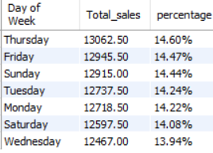

*Insights*:
- **Thursday** is the top-performing day, with the **highest** sales at **14.60%**.

- **Sales are relatively stable throughout the week**, with the **lowest (Wednesday)** still contributing **13.94%**.

- **Weekends (Friday to Sunday)** show **strong performance** as expected, likely due to increased leisure-time consumption.

- **Recommendation**: **Introduce targeted promotions on mid-week, such as “Midweek Deals” or limited-time offers**, to lift sales on the lowest-performing day.

## 5. Dashboard
[Cafe Sales Dashboard](cafe_dashboard.xlsx)

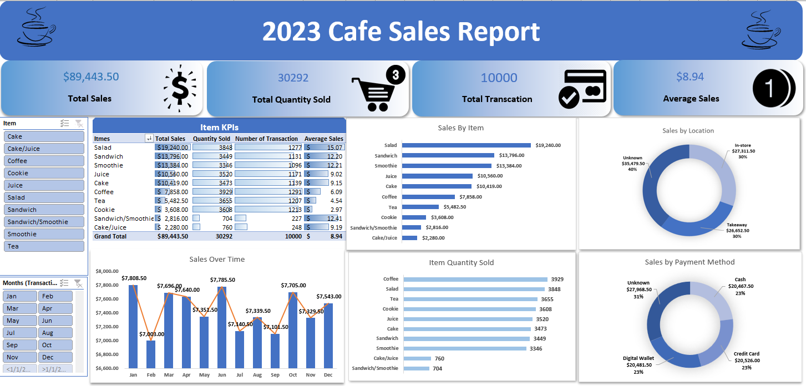

## 6. Conclusion and Recommendations

**Sales Performance Overview**:
- **Monthly Sales**: The **highest** Revenue by month is **January (7808.50)**, and the **lowest is February (7003.00)**, with **a maximum difference of less than 1%**. This shows that **overall sales performance is very stable**.
- **Product Performance**: There is a **small difference of 583 in the quantity sold between the most sold item (3,929) and the least sold (3,346)**. This displays **stable revenue streams with no dependencies on any single item** to perform extremely well.
- However, **the revenue generated by each item is corollary to its price per unit rather than the number of units sold**. For instance, Coffee, despite being the most popular item sold, only accounts for 8.79% of revenue. Whereas Smoothie, the least popular item sold, generates 14.96% of the revenue because it is listed at a higher price.

**Customer Behavior Overview**:
- **Customer Spending Habits**: The **average spending** of **8.94** falls within the **mid-to-low price range**, indicating that most customers tend to shop within the '**affordable spending**' segment.
- **Diverse Customer Preference**: **All known payment methods contribute nearly equally to the overall share**, with no single option showing a dominant preference. **Encouraging cashless payments may provide a better transaction experience for customers and businesses** as they are faster and reduce errors in handling cash compared to traditional cash payment methods.
- There is **no distinct customer preference for dining in-store or takeaway**, both channels are even in terms of revenue.

**Recommendations**:
- **Marketing & Promotions**:
    - **Seasonal promotions during occasions like Christmas, New Year, Easter, and Halloween** can boost sales by **providing festive-themed products or seasonal discounts**.
    - **Promoting 7.00-10.00 bundled products as the default choice** could match customer expectations and drive higher order values.
    - **Introduce Mid-week Promotions to boost sales throughout the whole week**.
    - **Adjust menu by highlighting seasonal bestsellers, placing them at the top or tagging them as "Recommended"** to boost conversion rates.
- **Selling Strategies**:
    - For all **beverages**, **offering different sizes (e.g. small, medium, and large) at tiered prices** can better **meet customer needs and help increase the average sales per transaction**.
    - **Offer alternative types of milk for an additional cost for customers' coffee**. With salad being the second most popular item sold, it is reasonable to assume **there is a high demand for healthier options and/or growth in veganism and similar dietary lifestyles** where plant-based milk will appeal to these customer segments.
    - **Promote different products from different categories in a transaction**. For example, encourage customers to buy cookies or cake with their tea or coffee.
    - **Offer bundles such as a ‘meal deal’**, where customers can purchase a beverage, a sandwich, and a snack together.


